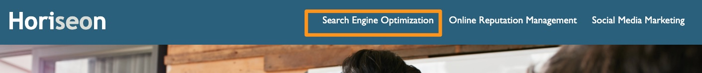

# Horiseo accessibility update

## Description
The Client requested an update to their current homepage to make it more accessible and user-friendly. I edited existing code to make sure the site follows best practices for accessibility, all links are functioning correctly, and images have alt tags. I also cleaned up the code on the back end so that it is easier to read and edit for the future.

I learned to add alt tags to images, condense CSS styles, check links and headings, along with add more descriptive element tags such as 'footer' and 'article'.

## Usage
'Search Engine Optimization' in the nav bar now leads to the SEO section in the body of the site.
    
    
All images and icons have alt text to aid screen readers.
    

## Credits
Trilogy Education Services, LLC, a 2U, Inc. brand. Visit them here [https://www.trilogyed.com/]
